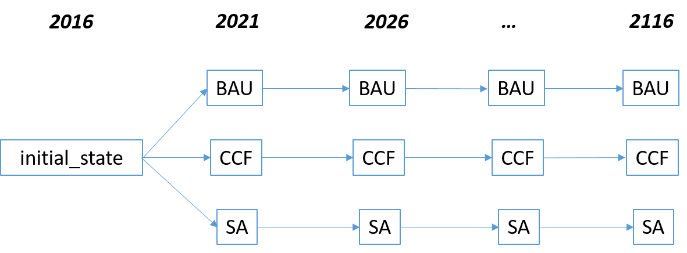
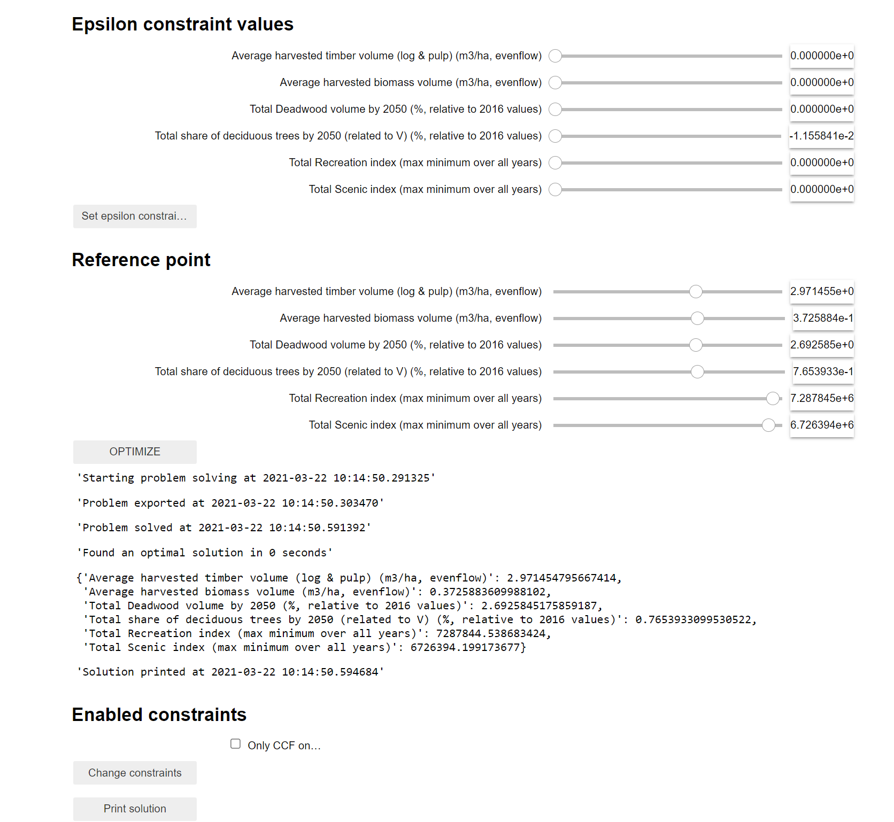

#### Last update:
20-01-2022


## General
The <b>multiforestOptimizationNotebook</b> was developed for the project "MultiForest - Management for multifunctionality in European forests in the era of bioeconomy" (https://www.jyu.fi/BERG/berg-projects-1/forest-values). The framework provides a set of rules that can be combined to create a unique multi-objective optimization problem. Particularly, it can be used to optimize forest management for forest ecosystem service and biodiversity objectives, while seeking an efficient management solution for individual forest entities (forest stands). The optimization problem can be created by adjusting the settings in a Jupyter notebook and a graphical user interphase (GUI).

The optimization tool was developed under the lead of the company Silo AI together with project partners from: University of Jyväskylä, Technical University of Munich, Norwegian Institute of Bioeconomy Research, and Swedish University of Agricultural Sciences.

## Getting started

* Anaconda Python (https://www.anaconda.com/products/individual), install for User only (does not require administrative permissions)
* Python 3 version (Python 2 should also work though, but not tested)
* Run conda prompt
* Ortools and Pandas packages ("conda install pip"&"pip install ortools, pandas")
* Go to the directory containing the repository
* Run "jupyter notebook"
* From the files tab open the corresponding .ipynb file
* A browser window should open and you are ready to go
* Quick introductions to Jupyter Notebook can be found in e.g., Youtube (see e.g., https://www.youtube.com/watch?v=jZ952vChhuI)

## Using with Anaconda environments

* Create Anaconda environment "conda env create -f mainEnvironment.yml" from the directory containing the repository
* Activate the environtment using "conda activate multiForest"
* Everything should work by running "jupyter notebook" 


## Overview of main steps

#### 1.  
```import multiFunctionalOptimization as MFO```
Imports the package from the Python file.

#### 2.
```mfo = MFO.MultiFunctionalOptimization()```
Creates an instance of the class.

#### 3. 
```mfo.readData(filename, sampleRatio=0.1 )```
Reads the data from filename.

It takes a random sample of stands to reduce computation time (if commented out "#", whole data is taken). 

Input data consits of forest stand/inventory plot data simulated under different management regimes with a forest growth model. The data can be grouped into three types: 1) Indexing the data: stand ID, year, regime; 2) Indicators for assessing forest ecosystem services (they can differ between countries); 3) Additional info like climate change scenario, represented area by NFI plot, region/province, or NUTS2 level. 

The <b>first year gets only the regime “initial_state”</b> and can be considered as starting point for all regimes (same value for all regimes). This gets important, if indicator performances to the current situation have to be evaluated (e.g. no decline in biodiversity is allowed). 

#### 4.
```mfo.calculateTotalValuesFromRelativeValues(columnTypes=columnTypes)```
*columnTypes* is a dictionary, which has entries where the column name is the key and then we have a tupe with python data type and column type. Possible column types are:
* <b>"Relative to Area"</b> = indicator value relates 1 hectar -> scaled to represented area of NFI plot <br>
* <b>"Relative to volume"</b> = indicator relates to standing V (e.g. %-share of deciduous trees) -> scaled to the represented volume of the plot <br>
* <b>"Absolute Value"</b> = takes the inticator value as it is <br>

If *columTypes* is an empty dictionary, then the class tries to make all the column data types to float if possible. For column types "Relative to Area" and "Relative to volume" the class makes a new column, which name "Total_" combined with the original column type.

 
#### 5. 
```mfo.addRegimeClassifications(regimeClassNames = regimeClassNames,regimeClassregimes=regimeClassregimes)``` 
(OPTIONAL) Classify the regimes into category and create a new column, e.g. indicating if regime is "CCF_3, CCF_4, BAUwGTR" (TRUE/FLASE)

#### 6. 
(OPTIONAL) Calculate additional columns from data. As an example, ```mfo.data["new_column_name"] = mfo.data["column1"].values*mfo.data["column2].values``` creates a new column which is the itemwise product of two old columns.

#### 7.
```mfo.finalizeData(initialRegime="initial_state")``` 
Prepares the data for optimization and makes columns with name "Relative_", which means related to the intial values. For example, a value 1.1 in a stand in certain year would mean that the value has grown 10% from the beginning to the certain year.

```InitialValues = { "key":value }``` is an optional dictionary, which gives initial values of objectives when they cannot be calculated from the input data (as defined in the previous step). The keys are the keys of objectives and the values are the values of objectives.

#### 8. 
```mfo.defineObjectives(objectives,initialValues = initialValues)```
Defines objectives following the objective format defined in section [Objective format](##Objective-format) and call 

#### 9.
Define objectives using the format defined in section [Constraint format](##Constraint-format) and call ```mfo.calculateObjectiveRanges(debug=True)```. Evaluates the ranges of objectives by optimizing individually the ```mfo.defineConstraints(constraints)```

#### 10. 
```mfo.showGui()```
Shows the graphical user interface. Uses the sliders to define the preferences as described in section [Defining preferences using sliders](##Defining-preferences-using-slidres)


## Input data
Forest growth simulations under different management scenarios on stand/NFI plot level represent the input data. Different climate change scenarios are handled in seperate input data and optimized individually. Data can come from different ecosystem models and needs to be grouped in columns that:
 * <b>Indexing the data:</b> stand ID, year, regime (mandatory columns)
 * <b>Indicators representing ecosystem services</b> (country or model specific)
 * <b>Additional information</b> (optional)  

<b>IMPORTANT:</b> the first year of the data (starting year) is only once represented for each stand/plot and is indicated by the regime "initial_state". It represents the starting point for all simulated regimes - same initial stand situation for all regimes. All later years can be represented multiple times and are indicated by the corresponding regime (BAU; CCF; SA). This gets important, if indicator performances to the current situation have to be evaluated (e.g. no decline in biodiversity is allowed).




## Objective format
The objective function can be defined based on up to eight standardised attributes, arranged in the below order. <br>

<b>(1) "Unique_key" : [ (2) "Long human readable name", (3) "column name", (4) "max/min objective", (5) "year wise aggregation", (6) "stand wise aggregation" (, (7) target year OR (8) string of periodic targets) ]</b>

(1) <b>"Unique_key":</b> short identifier of the objective problem, includes usually the indicator name. <br>
(2) <b>"Long human readable name":</b> easy and understandable text that appears in the GUI, format of text is free. <br>
(3) <b>"column name":</b> definition of the indicator column that is optimized for. <br>
(4) <b>"max/min objective":</b> define if the objective is "max"imised or "min"imised. <br>
(5) <b>"year wise aggregation":</b>
 * optimize the <b>"min"</b>imum value over all time periods, 
 * optimize the <b>"average"</b> over all time periods, 
 * optimize the <b>"firstYear"</b> value, 
 * optimize the <b>"sum"</b> over all years, 
 * optimize a <b>"targetYearWithSlope"</b>, aim to achive a target value in a certain year and keep it above this value for all years afterwards, consider a linear increase from the initial situation,  
 * optimize a <b>"targetYear"</b>, same as above but without linear increase, 
 * optimize the <b>"lastYear"</b> over all time periods, 
 * optimize for "periodicTargets", each simulation period gets a certain target value (except initial year), 
 * optimize that the yearly increase is minimum <b>"minYearlyIncrease"</b>, 
 * optimize that the yearly increase is maximum <b>"maxYearlyIncrease"</b>, 
 * optimize that the periodic decrease is maximum <b>"maxDecreaseDuringNPeriods"</b>, 
 * optimize that the periodic increase is mimimum <b>"minIncreaseDuringNPeriods"</b>. 
    
(6) <b>"stand wise aggregation":</b>
 * take the <b>"sum"</b> of all stand/plot values, or of a smaller set <b>"subsetSum"</b> <br>
 * take the <b>"areaWeightedAverage"</b> of all stand/plot values, <br>
 * take the <b>"areaWeightedSum"</b> of all stand/plot values.<br>
    
Additional comment: the combination of "Total_"indicator values & "sum" results in the same outcome as the combination of basic indicator value and "areaWeightedSum"; e.g. "Total_HarvestedV" & "sum" = "HarvestedV" & "areaWeightedSum"; both calculate the total harvest over the whole landscape. <br>

The following two attributes are optional. <br>

(7) <b>target year:</b> define the year that is optimized. Can be any year except the initial year. Is used for the objectives "targetYear" & "targetYearWithSlope".<br>
(8) <b>periodic targets:</b> define one target value for each simulation step (except initial year). Is for example used for the demand values of GLOBIOM. 

Most of the options are what they say they are, but some may require additional description:
- **minYearlyIncrease**: This is mathematically , where f is the standwise aggregated objective. Note that minYearlyIncrease can be used only with maximized objectives.
- **maxYearlyIncrease**: This is mathematically , where f is the standwise aggregated objective. Note that maxYearlyIncrease can be used only with minimized objectives.
- **maxDecreaseDuringNPeriods**:  This is mathematically , where f is the standwise aggregated objective. Note that maxDecreaseDuringNPeriods can be used only with minimized objectives.
- **minIncreaseDuringNPeriods**:  This is mathematically , where f is the standwise aggregated objective. Note that minIncreaseDuringNPeriods can be used only with maximized objectives.


## Define initial values if not available in data (initial_state)

If the initial values are not available in the input data, e.g. for indicators like increment or harvested volume (see Finnish case), the values can be defined separately. Reason, those values are usually calculated after the first simulation step, why those are not available for the first year. 

Values can be defined by ```InitialValues = { "key":value }```, where "key" is the indicator column and value the missing initial value for the first year.


## Constraint format

The constaints can be defined based on the attributes in the below order. <br>

(1) "Shortname": [(2) "constraint type", (3) "human readable name", (4) (regimes), (5) "column in data"] <br>

(1) <b>"Shortname":</b> short identifier for the constraint<br>
(2) <b>"constraint type":</b>
* **Allowed regimes**: Only certain regimes are allowed on certain stands. There needs to be a column in the dataset, which has value 1 if the constraint applies to the stand and 0 if it does not. Requires also a list of allowed regimes for the stands, for which the column has value 1. Other regimes are not allowed on those stands (e.g. only CCF on Peatland).
* **Species reduction**: Defined for not allowing species amounts to reduce, but can be applied to any reduction. Requires the column name that we are following, the number of periods that we calculate the reduction for and a number between 0 and 1 which says how much the amount can relatively decrease. Assumes that the value is aggregated over the stands using sum, that is the constraint applies to the sum over all stands. Will not allow the amount to decrease more than the given relative amount during given number of periods.
* **less than**: The amount from one column needs to be less than a value from another column. Analogous to comparing to objectives and requiring one to be less than the other on each stand. Standwise aggregation for each column must be given and uses similar keywords to objectives.

(3) <b>"human readable name":</b> easy and understandable text that appears in the GUI, format of text is free. <br>
(4) <b>"(regimes)":</b> specify which regimes are considered, e.g. CCFregimes = [regime for regime in mfo.regimes if "CCF" in regime] + ["SA"] <br>
(5) <b>"column in data":</b> specify which columns is delegating the constraint, e.g. column indicating (0, or 1) if soil is peat <br>

<b>Note</b> that constraints can also established by defining an objective and then using the epsilon constraint in the GUI to set its value.


## Defining preferences using sliders (GUI)

The GUI offers three ways of adjustments.

<b>Epsilon constraint values:</b> These are hard targets that need to be first fulfiled. If the optimization does not match the epsilon contraints, the problem is not solved.

<b>Reference point:</b> These are so called "soft targets". If a reference point cannot be reached, the slider will be reduced until the next possible value. If higher values are possible than the defined reference point, the sliders will increase to the highest possible value.

<b>Enabled constraints:</b> By ticking the box those additional constraints can be considered. <br>
<b>ATTENTION:</b> remember to push the button "Change constraints". The enabled constraints are first considered after the button has been pushed (the same is the case if they need to be changed). <br>
<b>TIP:</b> if enabled constraints need to be considered, start with those before adjusting and optimizing for epsilon constraints and reference points!




## Export of Data

Currently, three kinds of data are exported and saved as a CSV.

<b>objective ranges:</b> ```mfo.objectiveRanges``` describes the minimum and maximum possible value for individually optimized objectives, the possible range of outcomes. Further, the objective ranges are saved as .json file) 

<b>objective value:</b> By pushing the button "Print solution" the optimal solution for each objective is exported that can be reached under the multiple objectives. 

<b>solution & solution_alldata:</b> The first data set contains the ideal regime (or share of regimes) for each stand under the multiple objectives. The second data set (solution_alldata) additionally contains the indicator values and their timely development for each stand under the optimal regime.


## Acknowledgement
The project <b>MultiForest</b> was supported under the umbrella of ERA-NET Cofund <b>"ForestValue"</b> by Academy of Finland, Business Finland, Federal Ministry of Agriculture, Forestry, Environment & Water Management (Austria), Agency for Renewable Resources (Germany), Research Council of Norway, Vinnova/Formas/SWEA (Sweden). ForestValue has received funding from the European Union's Horizon 2020 research and innovation program under grant agreement N° 773324.

[www.forestvalue.org](https://forestvalue.org/) 


